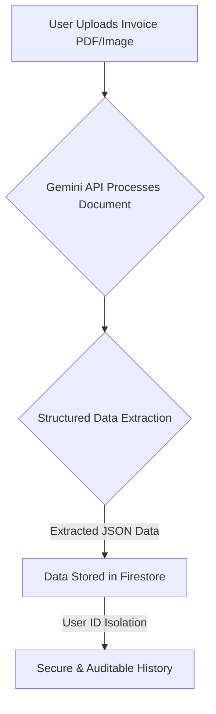

# InvoiceCoreProcessor: High-Level Documentation

## 1. Executive Summary

**The Problem:** Manual Accounts Payable (AP) processing is a significant operational bottleneck for modern finance departments. It is a slow, labor-intensive workflow that is highly susceptible to human error, leading to delayed payments, inaccurate financial reporting, and increased operational costs. Reconciling invoices manually consumes valuable time that could be dedicated to higher-value financial analysis.

**The Solution:** **InvoiceCoreProcessor** is an intelligent automation platform that directly addresses this challenge. By leveraging cutting-edge AI, the application provides an instant, automated data capture solution for invoices. Accounting and procurement teams can simply upload a scanned document or PDF, and the system immediately extracts the critical structured data required for AP processing. This eliminates manual data entry, drastically reduces the risk of error, and accelerates the entire procure-to-pay lifecycle.

## 2. Architectural Goals

The architecture of InvoiceCoreProcessor is founded on three core principles that deliver tangible business value:

-   **Accuracy**: The system's primary goal is to deliver data that is more accurate than manual entry. We achieve this by using the **Google Gemini API's structured output feature**, which contractually guarantees that the AI's response will contain the required fields (Vendor, Total, Due Date, etc.) in the correct format. This minimizes exceptions and ensures data reliability.

-   **Speed**: Time-to-process is a critical metric for AP efficiency. Our architecture is designed for real-time performance. From the moment an invoice is uploaded, the data extraction occurs in seconds, making the information immediately available for auditing, approval, and payment scheduling.

-   **Auditability**: A clear, immutable audit trail is essential for financial compliance. Every invoice processed through the system is logged in a persistent **Firebase Firestore** database. This creates a centralized, easily searchable history of all transactions, complete with timestamps, original file names, and the extracted data, simplifying internal and external audits.

## 3. Security & Compliance

Handling sensitive financial data is a core responsibility of the application. Our security model is designed for peace of mind:

-   **Data Isolation**: All processed invoice data is stored in Firestore under a path that is unique to the authenticated user (`userId`). This ensures that a user can only ever access their own data, providing strict tenant isolation.
-   **Secure Cloud Infrastructure**: By leveraging Google's secure and compliant APIs (Gemini and Firebase), we inherit a world-class security posture. All data in transit and at rest is protected by Google's robust infrastructure, which meets numerous global compliance standards.

## 4. Future Roadmap

InvoiceCoreProcessor is a foundational platform for AP automation. Future enhancements will focus on deeper integration and more advanced intelligence:

-   **ERP System Integration**: Develop connectors to automatically sync extracted invoice data with major ERP systems (e.g., SAP, Oracle NetSuite, QuickBooks), creating a seamless, end-to-end AP workflow.
-   **Three-Way Matching**: Implement automated three-way matching, where the system validates invoice data against the corresponding purchase order and goods receipt note to prevent fraudulent or duplicate payments.
-   **Anomaly Detection**: Enhance the AI model to automatically flag anomalies, such as unusual payment amounts, mismatched vendor details, or potential duplicate invoices, for manual review.

## 5. Application Workflow

The following diagram illustrates the high-level flow of the application, from invoice upload to secure storage.

