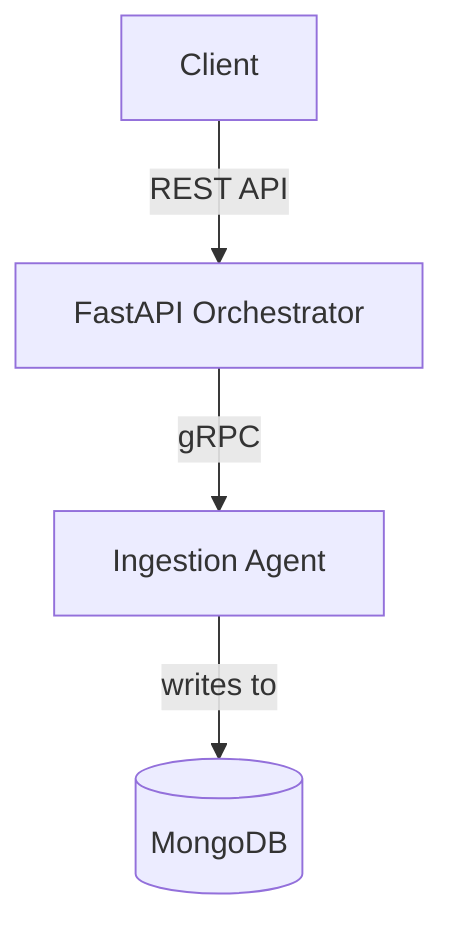

# InvoiceCoreProcessor - Ingestion Service

This project is the first step in building a distributed invoice processing system. It currently consists of a **FastAPI Orchestrator** and a backend **gRPC Ingestion Agent**.

## 1. Architecture

The current architecture is a simple, two-service system:
-   **FastAPI Orchestrator**: Exposes a public REST API (`/invoice/upload`) and manages the business workflow using LangGraph.
-   **Ingestion Agent (gRPC)**: A microservice responsible for handling the initial ingestion of an invoice. It simulates a file upload and saves the invoice's metadata to a MongoDB database.



## 2. Getting Started

### Prerequisites
-   Python 3.12+
-   `pip` for package management
-   A running MongoDB instance.

### Quick Start

1.  **Clone the repository**.
2.  **Install dependencies**:
    ```bash
    pip install -r requirements.txt
    ```
3.  **Configure the environment**:
    ```bash
    cp InvoiceCoreProcessor/.env.example InvoiceCoreProcessor/.env
    ```
    -   **Important**: Open `InvoiceCoreProcessor/.env` and ensure the `MONGODB_URI` is correct for your local or cloud MongoDB instance.
4.  **Run the application**:
    The easiest way to run the entire system is to use the end-to-end test script. This will start both the orchestrator and the ingestion agent.
    ```bash
    python e2e_test.py
    ```
    The orchestrator will be available at `http://localhost:8080`.

## 3. Configuration

Configuration is managed via environment variables in the `InvoiceCoreProcessor/.env` file.

| Variable                 | Description                             | Default                   |
| ------------------------ | --------------------------------------- | ------------------------- |
| `APP_HOST` / `_PORT`     | Host/port for the FastAPI orchestrator. | `0.0.0.0:8080`            |
| `INGESTION_SERVICE_HOST` / `_PORT` | Host/port for the Ingestion Agent.      | `localhost:50051`         |
| `MONGODB_URI`            | The full connection string for MongoDB. | `mongodb://localhost:27017/`|
| `MONGODB_DATABASE`       | The name of the database to use.        | `InvoiceProcessorDB`      |
| `MONGODB_COLLECTION`     | The name of the collection to use.      | `invoices`                |

## 4. API & Contracts

-   **REST API**:
    -   `POST /invoice/upload`: The main entry point. See the `main.py` file for the `InvoiceIngestionRequest` model.
-   **gRPC API**:
    -   The contract for the `IngestionAgent` is defined in `InvoiceCoreProcessor/protos/ingestion.proto`.

## 5. Testing
-   An end-to-end test is provided in `e2e_test.py`. It starts both services, calls the API, and verifies that the file is "uploaded" and the metadata is stored in MongoDB.
