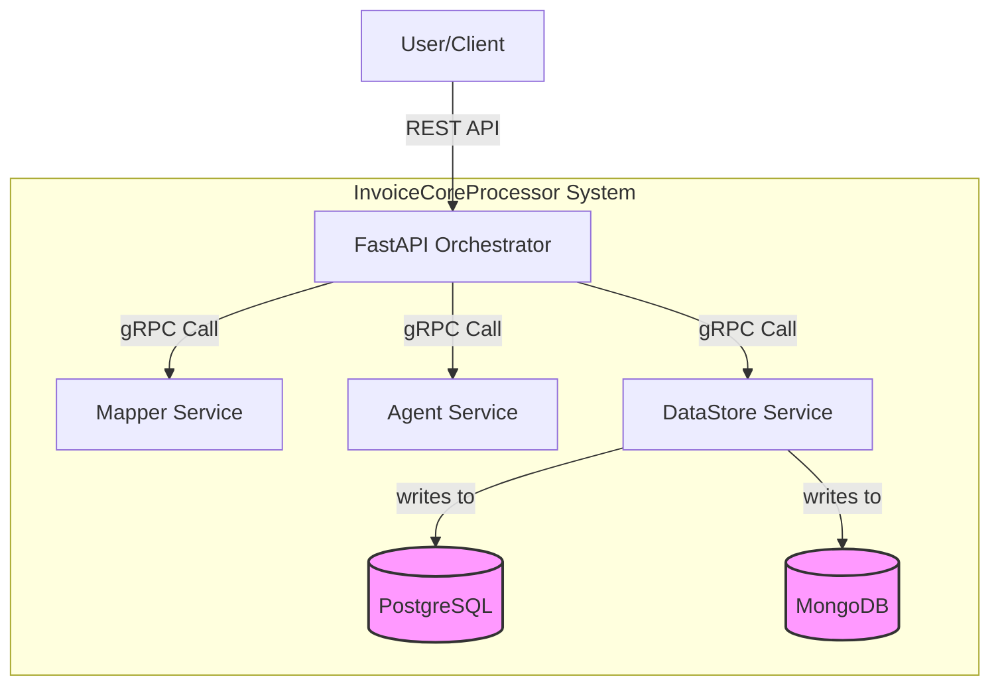

# InvoiceCoreProcessor System

This repository contains the `InvoiceCoreProcessor`, a distributed system for automated invoice data extraction and processing. It consists of a central orchestrator and several backend gRPC microservices.

## 1. Overview

-   **Purpose**: The `InvoiceCoreProcessor` system automates the full lifecycle of invoice processing, from document upload and AI-driven data extraction to validation and final storage.
-   **Place in System**: This system serves as the core engine for invoice data handling within a larger accounting platform. It receives raw invoice files and produces validated, structured data ready for accounting system integration.
-   **Boundaries**:
    -   **Owns**: The logic for orchestrating the invoice processing workflow, the rules for data validation (e.g., duplicate checks, high-value flags), the mapping of extracted data to accounting schemas, and the storage of the final validated record.
    -   **Does Not Own**: User identity and authentication, frontend UI, or direct integration with third-party accounting systems (it produces data *for* them).

## 2. Architecture

The system is built on a microservice architecture. A central **FastAPI Orchestrator** manages the workflow using LangGraph, making gRPC calls to specialized backend services.

-   **Sync APIs**:
    -   A primary REST endpoint (`POST /invoice/upload`) on the FastAPI Orchestrator to ingest new invoices.
    -   gRPC services for internal request/response communication.
-   **Async Interfaces**: None currently implemented.
-   **Dependencies**:
    -   **Mapper Service (gRPC)**: Maps extracted data to accounting schemas.
    -   **Agent Service (gRPC)**: Validates data and flags anomalies.
    -   **DataStore Service (gRPC)**: Persists validated data.
    -   **Databases (Conceptual)**: The DataStore service is designed to connect to PostgreSQL (for structured data) and MongoDB (for document storage), though the current implementation uses in-memory mocks.

### Architecture Diagram



## 3. Getting Started

### Prerequisites

-   Python 3.12+
-   `pip` for package management

### Quick Start

1.  **Clone the repository**.
2.  **Set up the environment**:
    ```bash
    # Install all required Python packages
    pip install -r requirements.txt

    # Create a local environment file from the example
    cp InvoiceCoreProcessor/.env.example InvoiceCoreProcessor/.env
    ```
3.  **Run the end-to-end test script**:
    This script will automatically start the orchestrator and all microservices in the correct order.
    ```bash
    python e2e_test.py
    ```
    If the tests pass, the full system is running correctly. The orchestrator is available at `http://localhost:8080`.

### Configuration

Configuration is managed via environment variables loaded from the `InvoiceCoreProcessor/.env` file.

| Variable                 | Description                                    | Required | Default     |
| ------------------------ | ---------------------------------------------- | -------- | ----------- |
| `MAPPER_SERVICE_HOST`    | Hostname for the Mapper gRPC service.          | No       | `localhost` |
| `MAPPER_SERVICE_PORT`    | Port for the Mapper gRPC service.              | No       | `50051`     |
| `AGENT_SERVICE_HOST`     | Hostname for the Agent gRPC service.           | No       | `localhost` |
| `AGENT_SERVICE_PORT`     | Port for the Agent gRPC service.               | No       | `50052`     |
| `DATASTORE_SERVICE_HOST` | Hostname for the DataStore gRPC service.       | No       | `localhost` |
| `DATASTORE_SERVICE_PORT` | Port for the DataStore gRPC service.           | No       | `50053`     |
| `APP_HOST`               | Host for the main FastAPI Orchestrator.        | No       | `0.0.0.0`   |
| `APP_PORT`               | Port for the main FastAPI Orchestrator.        | No       | `8080`      |

### Database

The `DataStore` service is currently mocked to use in-memory Python dictionaries. For a real deployment, you would configure the `POSTGRES_DB_URL` and `MONGO_DB_URL` variables in the `.env` file and implement the database connection logic. Migrations would be handled by a standard tool like `alembic`.

## 4. API & Contracts

### REST API

The primary entry point to the system.

-   **OpenAPI Docs**: Not yet implemented, but can be added to the FastAPI app.
-   **Endpoint**: `POST /invoice/upload`
-   **Request Body**:
    ```json
    {
      "raw_file_ref": "/path/to/invoice.pdf",
      "user_id": "user-123"
    }
    ```
-   **Success Response**:
    ```json
    {
      "status": "Workflow completed",
      "final_state": "SUCCESS: Invoice processed and stored."
    }
    ```

### gRPC API

The internal communication between the orchestrator and the microservices is handled by gRPC.
-   **Protobuf Definitions**: The service and message contracts are defined in the `.proto` files located in [`InvoiceCoreProcessor/protos/`](./InvoiceCoreProcessor/protos/).

## 5. Observability & Ops

-   **Logging**: All services output plaintext logs to `stdout`. The format is not standardized JSON yet.
-   **Metrics**: No Prometheus `/metrics` endpoint is exposed yet.
-   **Tracing**: No distributed tracing (e.g., OpenTelemetry) is implemented.
-   **Health & Readiness**: No health check endpoints (`/health`, `/ready`) are implemented yet. These are critical additions for a production environment.

## 6. Security & Compliance

-   **Authentication**: There is no service-to-service authentication. The system assumes it runs within a trusted internal network.
-   **Authorization**: No authorization model is currently in place.
-   **Secrets**: Secrets (like database URLs) should be managed via the `.env` file, which should **never** be committed to the repository.
-   **Data Classification**: The service handles potentially sensitive financial data from invoices.

## 7. Testing & Quality

-   **End-to-End Tests**: The primary method of testing. Run the full system test with:
    ```bash
    python e2e_test.py
    ```
-   **Unit Tests**: Not yet implemented. `pytest` would be the standard tool.
-   **Linting**: Not configured, but `ruff` and `black` are recommended for future use.

## 8. Failure Modes & Troubleshooting

-   **Connection Refused Errors**: This typically means one or more of the microservices failed to start. Check the logs from the `e2e_test.py` script for `ModuleNotFoundError` or other startup errors.
-   **`ImportError: attempted relative import with no known parent package`**: This occurs if you run a service file directly (`python .../main.py`) instead of as a module. Use `python -m <package>.<module>` to run services.
-   **Debug Logging**: All services print their status to `stdout`. For more detailed debugging, add more `print` statements to the relevant service.

## 9. Contribution Guide

-   **Branching**: Please use feature branches (e.g., `feat/add-health-checks`).
-   **Commits**: Follow the [Conventional Commits](https://www.conventionalcommits.org/en/v1.0.0/) specification.
-   **Code Review**: All changes must be submitted via a Pull Request and approved by at least one other developer.
