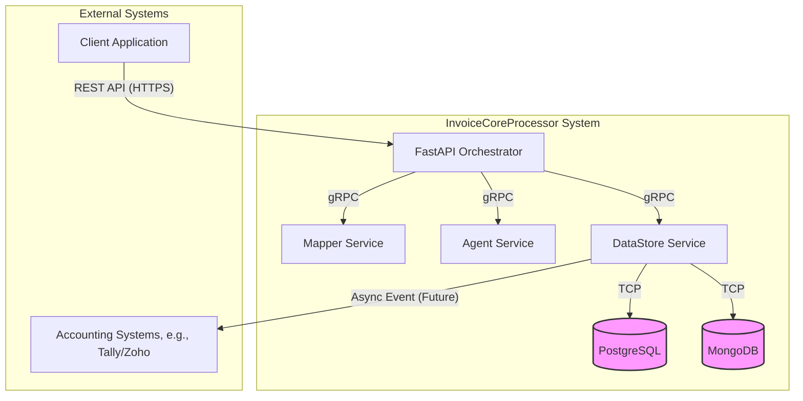
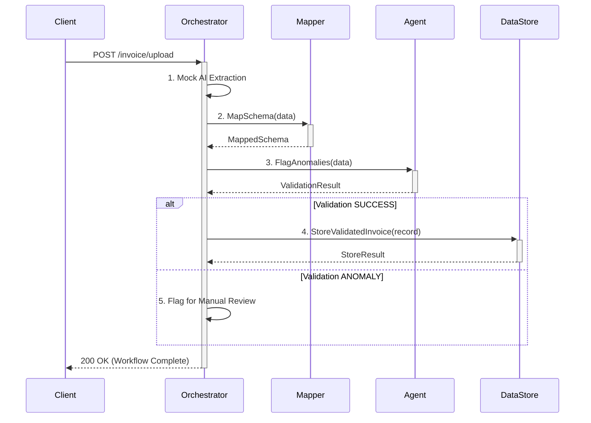

# InvoiceCoreProcessor: System Architecture & High-Level Documentation

## 1. Purpose of This Document
This document provides a comprehensive, high-level overview of the **InvoiceCoreProcessor** system. It is intended for architects, new engineers, product managers, and technical stakeholders who need to understand the system's architecture, microservice responsibilities, key workflows, and operational principles without deep-diving into the source code.

This document serves as the "source of truth" for system-level design and architectural decisions.

## 2. System Overview

### What the system does
The InvoiceCoreProcessor is a backend system designed to automate the ingestion and initial processing of financial invoices. It accepts raw invoice files (e.g., PDFs, images) and orchestrates a workflow that uses mock data to simulate extraction, validates that data against business rules, and persists the results in a reliable, auditable format.

### Key business goals
-   **Automation**: Eliminate manual data entry to accelerate the Accounts Payable (AP) lifecycle.
-   **Reliability**: Ensure high accuracy in data validation to minimize costly errors.
-   **Auditability**: Maintain an immutable record of every invoice processed for compliance and financial reporting.
-   **Scalability**: Handle variable loads, from single invoice uploads to large bulk processing events.

### Primary user personas
-   **Accounting Team**: The primary users who upload invoices and rely on the extracted data for their daily work.
-   **System Administrator**: Responsible for monitoring the health and performance of the microservices.
-   **Data Analyst**: Uses the persisted data to generate financial reports and dashboards.

## 3. High-Level Architecture

The system follows a distributed, microservice-based architecture. A central **Orchestrator** service manages the business workflow, communicating with specialized backend microservices via gRPC. This decoupled design allows for independent scaling, deployment, and maintenance of each component.

-   **Microservices**: `FastAPI Orchestrator`, `Mapper Service`, `Agent Service`, `DataStore Service`.
-   **APIs**: A REST API for ingestion and internal gRPC APIs for service-to-service communication.
-   **Storage Layers**: PostgreSQL for structured invoice data and MongoDB for unstructured metadata and file references.
-   **External Integrations**: The system is designed to eventually push validated data to external accounting systems (e.g., Tally, Zoho Books).

## 4. Microservice Responsibilities

### 4.1. FastAPI Orchestrator
-   **Purpose**: To manage the end-to-end business workflow of processing an invoice.
-   **Responsibilities**:
    -   Owns the LangGraph state machine that defines the invoice processing pipeline.
    -   Exposes the public-facing REST API for invoice ingestion.
    -   Coordinates calls to the `Mapper`, `Agent`, and `DataStore` services.
    -   Does **not** own any business logic or data storage; it is purely a coordinator.
-   **Dependencies**: `Mapper Service`, `Agent Service`, `DataStore Service`.

### 4.2. Mapper Service
-   **Purpose**: To transform extracted invoice data into formats required by downstream systems.
-   **Responsibilities**:
    -   Owns the mapping logic from the canonical invoice model to specific accounting schemas (e.g., TallyPrime, Zoho Books).
    -   Does **not** own validation or storage logic.
-   **Inputs & Outputs**:
    -   **Input**: gRPC `MapSchema` request containing extracted data.
    -   **Output**: gRPC `MapSchema` response with schema-specific JSON.
-   **Dependencies**: None.

### 4.3. Agent Service
-   **Purpose**: To enforce business rules and perform validation on invoice data.
-   **Responsibilities**:
    -   Owns the validation logic (e.g., duplicate invoice checks, high-value invoice flagging).
    -   Does **not** own data mapping or storage.
-   **Inputs & Outputs**:
    -   **Input**: gRPC `FlagAnomalies` request.
    -   **Output**: gRPC `ValidationResult` response with status and anomaly flags.
-   **Dependencies**: Potentially the `DataStore Service` in the future to check for duplicates.

### 4.4. DataStore Service
-   **Purpose**: To provide a persistent, reliable storage layer for all invoice data.
-   **Responsibilities**:
    -   Owns the canonical data models for invoices and the connection logic to the databases.
    -   Manages the database schema and transactions.
    -   Does **not** own any business logic beyond data persistence.
-   **Inputs & Outputs**:
    -   **Input**: gRPC `StoreValidatedInvoice` request.
    -   **Output**: Writes to PostgreSQL and MongoDB.
-   **Dependencies**: PostgreSQL, MongoDB.

## 5. Key Workflows

### Invoice Upload & Processing Workflow

**Steps**:
1.  **Ingestion & Extraction**: The `Orchestrator` receives an invoice file and generates mock extracted data.
2.  **Schema Mapping**: The `Orchestrator` sends the extracted data to the `Mapper Service` to get accounting-specific schemas.
3.  **Validation**: The `Orchestrator` sends the data to the `Agent Service` to check for anomalies.
4.  **Data Integration (Success Path)**: If validation passes, the `Orchestrator` sends the complete, validated record to the `DataStore Service` for persistence.
5.  **Manual Review (Anomaly Path)**: If anomalies are found, the `Orchestrator` marks the invoice for manual review.

## 6. Error Handling & Failure Modes

-   **Retry Patterns**: Currently, there are no automated retries. A gRPC call failure will cause the entire workflow to fail.
-   **Circuit Breakers**: Not implemented.
-   **Idempotency**: The `DataStore Service` should enforce idempotency based on a unique invoice ID to prevent duplicate record creation from retries.
