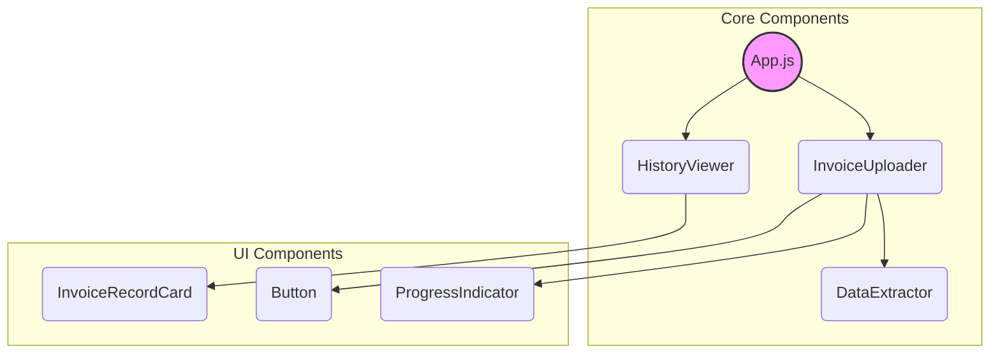
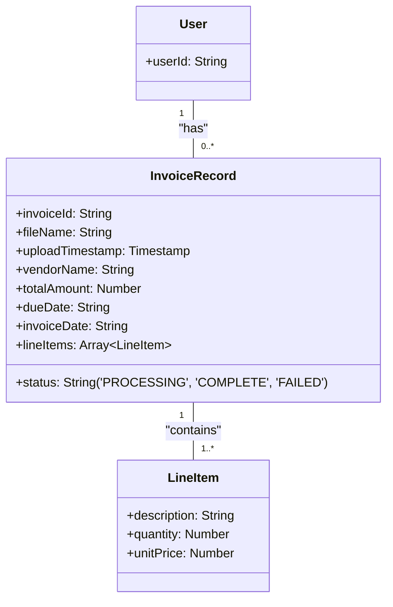

# InvoiceCoreProcessor: Technical Documentation

## 1. Component Structure

The frontend is a single-page application built with React. The component architecture is designed to be modular and maintainable, separating concerns for state management, API interaction, and UI rendering.



-   **`App`**: The root component. It manages the overall application state, including the user's authentication status and the list of processed invoices.
-   **`InvoiceUploader`**: Handles the file selection and upload logic. It is responsible for triggering the data extraction process.
-   **`DataExtractor`**: A non-UI component that contains the core logic for interacting with the Gemini API. It takes an uploaded file as input and returns the extracted JSON data.
-   **`HistoryViewer`**: Subscribes to the Firestore collection and displays the list of processed invoices in real-time.

## 2. API Integration: Gemini for Structured Data Extraction

The core of the application is its integration with the Gemini API to perform multimodal document analysis and structured data extraction.

### API Call Structure

We use the `gemini-2.5-flash-preview-09-2025` model due to its speed and multimodal capabilities. The key to ensuring reliable data extraction is forcing the API to return a JSON object that conforms to a predefined schema. This is accomplished by setting `responseMimeType: "application/json"` in the `generationConfig` of the request.

Example `fetch` call to the Gemini API:

```javascript
const API_ENDPOINT = `https://generativelanguage.googleapis.com/v1beta/models/gemini-2.5-flash-preview-09-2025:generateContent?key=${API_KEY}`;

async function extractInvoiceData(imageBytesBase64) {
  const requestBody = {
    contents: [{
      parts: [
        { text: "Extract all details from this invoice, including every line item. Respond ONLY with the JSON object." },
        { inline_data: { mime_type: "image/jpeg", data: imageBytesBase64 } }
      ]
    }],
    generationConfig: {
      response_mime_type: "application/json",
      response_schema: {
        type: "OBJECT",
        properties: {
          vendorName: { type: "STRING" },
          totalAmount: { type: "NUMBER" },
          dueDate: { type: "STRING", description: "Date in YYYY-MM-DD format." },
          invoiceDate: { type: "STRING", description: "Date in YYYY-MM-DD format." },
          lineItems: {
            type: "ARRAY",
            items: {
              type: "OBJECT",
              properties: {
                description: { type: "STRING" },
                quantity: { type: "NUMBER" },
                unitPrice: { type: "NUMBER" }
              },
              required: ["description", "quantity", "unitPrice"]
            }
          }
        },
        required: ["vendorName", "totalAmount", "dueDate", "invoiceDate", "lineItems"]
      }
    }
  };

  const response = await fetch(API_ENDPOINT, {
    method: 'POST',
    headers: { 'Content-Type': 'application/json' },
    body: JSON.stringify(requestBody)
  });

  const data = await response.json();
  // The response is guaranteed to be a JSON object matching the schema
  return JSON.parse(data.candidates[0].content.parts[0].text);
}
```

## 3. Firestore Implementation

Firebase Firestore is used for data persistence. The database schema is designed to be scalable and secure, leveraging user-based document pathing.

### Data Pathing

Each user's data is stored in a sub-collection under their unique `userId`. This is the core of the security model, as Firestore's security rules can be configured to only allow a user to read or write to their own path.

**Full Collection Path**: `/artifacts/{__app_id}/users/{userId}/invoice_records`

### Real-time Updates

The `HistoryViewer` component uses the `onSnapshot` listener from the Firestore SDK. This provides real-time updates to the UI whenever an invoice record is created or its status changes, without needing to poll the database.

```javascript
import { collection, onSnapshot, query, orderBy } from "firebase/firestore";

// Inside the HistoryViewer React component
useEffect(() => {
  if (!auth.currentUser) return;

  const userId = auth.currentUser.uid;
  const recordsCollection = collection(db, `artifacts/APP_ID/users/${userId}/invoice_records`);
  const q = query(recordsCollection, orderBy("uploadTimestamp", "desc"));

  const unsubscribe = onSnapshot(q, (querySnapshot) => {
    const records = [];
    querySnapshot.forEach((doc) => {
      records.push({ id: doc.id, ...doc.data() });
    });
    setInvoiceHistory(records);
  });

  return () => unsubscribe(); // Cleanup listener on component unmount
}, [auth.currentUser]);
```

## 4. Data Serialization

The data serialization process is straightforward. The JSON object returned by the Gemini API is guaranteed to match the required schema, which is directly compatible with Firestore's data model. The entire JSON object, including the nested `lineItems` array of objects, is saved directly into the Firestore document.

### Database Schema Diagram


