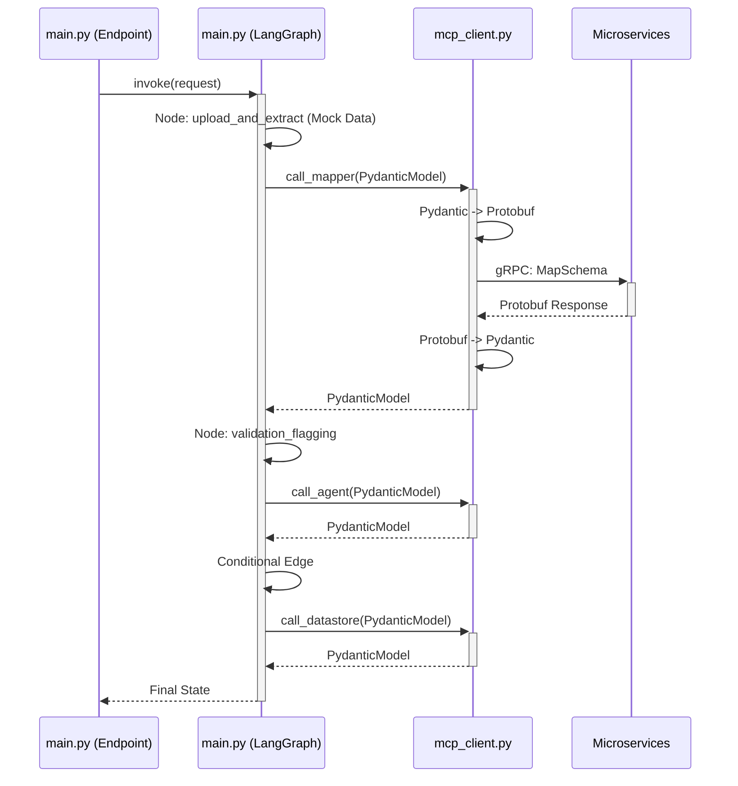

# InvoiceCoreProcessor: Technical Specification

## 1. Introduction

### Purpose of this Document
This document provides a detailed technical description of the `InvoiceCoreProcessor` system. It is intended for software engineers and developers responsible for maintaining, extending, testing, and deploying the services. It complements the high-level `SYSTEM_ARCHITECTURE.md` by providing deep implementation details.

### Scope
-   **Code Structure**: The layout of the Python packages and modules.
-   **API Design**: The public REST API and internal gRPC contracts.
-   **Data Models**: Internal Pydantic models and Protobuf message schemas.
-   **Tech Stack**: All languages, frameworks, and tools used.
-   **Internal Workflows**: The detailed flow of logic within the orchestrator.
-   **Testing & Deployment**: Strategies for local development, testing, and deployment.

## 2. Technology Stack

### 2.1 Backend
-   **Language**: Python 3.12
-   **Frameworks**:
    -   FastAPI (for the REST API Orchestrator)
    -   LangGraph (for workflow orchestration)
    -   `grpcio` (for the microservice framework)
-   **Configuration**: `python-dotenv`

### 2.2 Storage
-   **Databases**: The system is designed for PostgreSQL (structured data) and MongoDB (unstructured data), though the current implementation uses in-memory mocks.

### 2.3 Messaging
-   gRPC is used for all synchronous, internal service-to-service communication.

### 2.4 Dev Tools
-   **Dependency Management**: `pip` with `requirements.txt`.
-   **Testing Frameworks**: The E2E test uses the `requests` library.

## 3. Repository Structure

```
/
├── InvoiceCoreProcessor/
│   ├── __init__.py
│   ├── main.py             # FastAPI Orchestrator entry point
│   ├── mcp_client.py       # gRPC client for microservices
│   ├── models.py           # Pydantic models for internal state
│   ├── generated/          # Compiled Protobuf Python files
│   ├── microservices/
│   │   ├── mapper/
│   │   ├── agent/
│   │   └── datastore/
│   └── protos/             # .proto contract definitions
├── e2e_test.py             # End-to-end test script
├── requirements.txt
└── README.md
```

-   `InvoiceCoreProcessor/`: The main Python package.
-   `main.py`: The FastAPI application that orchestrates the workflow.
-   `mcp_client.py`: A client wrapper that handles gRPC communication and Pydantic/Protobuf conversion.
-   `models.py`: Defines the internal, type-safe data structures used by the orchestrator.
-   `generated/`: Contains Python code generated by the `protoc` compiler. **Do not edit manually.**
-   `microservices/`: Contains the implementation for each gRPC microservice.
-   `protos/`: The source of truth for all gRPC API contracts.

## 4. Configuration & Environment Variables

Configuration is managed via a `.env` file in the `InvoiceCoreProcessor` directory.

| Variable                 | Description                      | Required | Default     |
| ------------------------ | -------------------------------- | -------- | ----------- |
| `MAPPER_SERVICE_HOST`    | Hostname for the Mapper service. | No       | `localhost` |
| `MAPPER_SERVICE_PORT`    | Port for the Mapper service.     | No       | `50051`     |
| `AGENT_SERVICE_HOST`     | Hostname for the Agent service.  | No       | `localhost` |
| `AGENT_SERVICE_PORT`     | Port for the Agent service.      | No       | `50052`     |
| `DATASTORE_SERVICE_HOST` | Hostname for the DataStore service.| No       | `localhost` |
| `DATASTORE_SERVICE_PORT` | Port for the DataStore service.  | No       | `50053`     |
| `APP_HOST`               | Host for the FastAPI app.        | No       | `0.0.0.0`   |
| `APP_PORT`               | Port for the FastAPI app.        | No       | `8080`      |

## 5. APIs

### 5.1 REST Endpoint
The single public entry point for the system.

-   **Path**: `/invoice/upload`
-   **Method**: `POST`
-   **Auth**: None
-   **Request Body Schema**:
    ```json
    {
      "raw_file_ref": "string",
      "user_id": "string"
    }
    ```
-   **Success Response (200 OK)**:
    ```json
    {
      "status": "Workflow completed",
      "final_state": "SUCCESS: Invoice processed and stored."
    }
    ```
-   **Error Codes**: `500 Internal Server Error` on workflow failure.

### 5.2 gRPC Interfaces
Internal communication is handled via gRPC. The contracts are defined in `InvoiceCoreProcessor/protos/`.

-   **`mapper.proto`**: Defines the `Mapper` service with a `MapSchema` RPC.
-   **`agent.proto`**: Defines the `Agent` service with a `FlagAnomalies` RPC.
-   **`datastore.proto`**: Defines the `DataStore` service with a `StoreValidatedInvoice` RPC.
-   **`common.proto`**: Defines shared message types like `ExtractedInvoiceData`.

## 6. Internal Architecture

### 6.1 Core Components (Orchestrator)
-   **FastAPI App (`main.py`)**: Defines the `/invoice/upload` endpoint. Its primary role is to receive requests, manage the gRPC client lifecycle, and invoke the workflow.
-   **LangGraph Workflow (`main.py`)**: A state machine that defines the invoice processing pipeline. Each node in the graph represents a step (e.g., `schema_mapping`, `validation_flagging`).
-   **MCPClient (`mcp_client.py`)**: Acts as an **Adapter** to the gRPC microservices. It encapsulates the gRPC channel and stub logic and, critically, handles the serialization/deserialization between the internal Pydantic `models` and the wire-format Protobuf messages.

### 6.2 Internal Flow
The workflow is orchestrated by LangGraph within a single API call.



## 7. Data Models

### Pydantic Domain Models
The internal "source of truth" for data structures, defined in `InvoiceCoreProcessor/models.py`.

```python
class ExtractedInvoiceData(BaseModel):
    invoice_no: str
    vendor_gstin: str
    total_amount: float
    item_details: List[ItemDetail]
    confidence_score: float
```

## 8. Business Logic

-   **Duplicate Detection**: Mocked in the `Agent` service by checking against a hardcoded list of invoice numbers. A real implementation would require a database lookup.
-   **Anomaly Detection**: The `Agent` service flags invoices with a `total_amount` greater than 10,000 as `HIGH_VALUE_INVOICE`.

## 9. Security

-   **Authentication**: None. Assumes a trusted internal network.
-   **Authorization**: None.

## 10. Testing

-   **E2E Tests (`e2e_test.py`)**: A single script that starts all services and the orchestrator, then sends requests to the API to verify the success and anomaly workflows.
-   **How to run**: `python e2e_test.py`

## 11. Local Development Setup

1.  **Install Dependencies**: `pip install -r requirements.txt`
2.  **Set up Environment**: `cp InvoiceCoreProcessor/.env.example InvoiceCoreProcessor/.env`
3.  **Run Services**: The easiest way to run the entire system is using the end-to-end test script.
    ```bash
    python e2e_test.py
    ```
